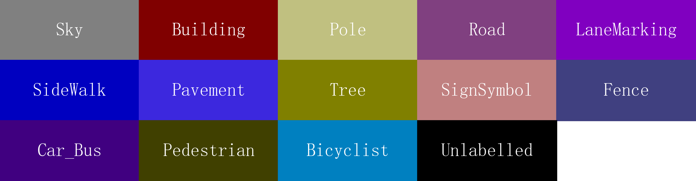

# 基于UNet的街景图像分割方法

# 1. 引言
在计算机视觉领域，图像分割是一个重要的研究方向。本文将介绍一种基于UNet架构的街景图像分割方法。UNet是一种常用于医学图像分割的卷积神经网络（CNN）架构，但也可以应用于其他类型的图像分割任务。
## 1.1 研究背景与意义
随着智能交通和自动驾驶技术的快速发展，街景图像分割作为环境感知的关键环节，受到了广泛关注。图像分割能够将道路、车辆、行人、标志线等不同类别的目标从复杂场景中精确分离，为后续的目标检测、路径规划等任务提供基础支持。UNet 作为一种经典的卷积神经网络结构，因其对小样本数据的高效利用和对细粒度目标的良好分割能力，被广泛应用于医学图像和自然场景分割任务中。将 UNet 应用于街景图像分割，有助于提升城市交通管理和自动驾驶系统的智能化水平。

## 1.2 相关工作综述
近年来，图像分割领域涌现了多种深度学习方法。FCN（全卷积网络）首次将卷积神经网络应用于像素级分割任务，开启了端到端分割的新篇章。随后，SegNet、DeepLab等模型在结构设计和特征提取方面不断优化，提升了分割精度。UNet 结构以其对称的编码器-解码器设计和跳跃连接机制，有效融合了多尺度特征，显著改善了边界和小目标的分割效果。针对街景图像分割任务，研究者们还提出了多种改进策略，如引入注意力机制、特征金字塔、损失函数优化等，以进一步提升模型在复杂场景下的表现。尽管如此，如何在保证分割精度的同时兼顾模型的泛化能力和计算效率，仍是当前研究的重点和难点。

# 2. 数据集与预处理
## 2.1 CamVid 数据集介绍
CamVid（Cambridge-driving Labeled Video Database）是自动驾驶和城市街景分割领域常用的公开数据集之一。该数据集包含晴天（sunny）和多云（cloudy）两种天气条件下的城市道路场景图像，并为每一帧提供了像素级的语义分割标注。标注类别包括：Sky、Building、Pole、Road、LaneMarking、SideWalk、Pavement、Tree、SignSymbol、Fence、Car_Bus、Pedestrian、Bicyclist 及 Unlabelled 共14类，涵盖了道路、车辆、行人、标志线等典型城市交通元素。

本项目对 CamVid 数据集进行了详细的统计分析和可视化。从[表1](#table1)可以看出，像素占比最高的类别为 Road、Building 和 Sky，而小目标类别（如 SignSymbol、Bicyclist、Pole 等）像素占比较低但实例数量较多，反映了街景分割中小目标检测的挑战性。

<b>表1  CamVid数据集不同类别像素占比与实例数统计（晴天与多云）</b>

| 类别         | Sunny 占比(%) | Cloudy 占比(%) | Sunny 实例数 | Cloudy 实例数 |
|--------------|---------------|---------------|--------------|--------------|
| Sky          | 14.93         | 19.76         | 576          | 105          |
| Building     | 23.44         | 21.02         | 563          | 106          |
| Pole         | 1.03          | 0.82          | 576          | 105          |
| Road         | 29.93         | 16.73         | 577          | 106          |
| LaneMarking  | 1.88          | 0.86          | 573          | 105          |
| SideWalk     | 6.77          | 4.28          | 548          | 106          |
| Pavement     | 0.00          | 0.00          | 0            | 0            |
| Tree         | 9.29          | 15.20         | 513          | 106          |
| SignSymbol   | 0.14          | 0.03          | 380          | 35           |
| Fence        | 1.61          | 0.53          | 323          | 29           |
| Car_Bus      | 3.52          | 9.41          | 560          | 106          |
| Pedestrian   | 4.65          | 4.55          | 577          | 106          |
| Bicyclist    | 0.53          | 0.54          | 290          | 65           |
| Unlabelled   | 2.29          | 6.27          | 577          | 106          |

我们还对像素占比数据进行了可视化，结果如[图1](#fig1)所示。可以看出，晴天和多云条件下的像素分布存在一定差异，晴天条件下 Road、Building 和 Sky 的占比较高，而多云条件下 Sky 的占比显著增加，这可能与光照条件对图像质量的影响有关。

<b>图1  CamVid数据集不同类别像素占比可视化</b>

对于Sunny子集包含 345 张训练图像， 140 张验证图像和 92 张测试图像；Cloudy子集包含 74 张训练图像， 24 张验证图像和 8 张测试图像。数据集划分情况如[图2](#fig2)所示。

<b>图2  CamVid数据集划分情况</b>

## 2.2 数据增强方法

为提升模型的泛化能力和鲁棒性，项目实现并采用了多种数据增强策略，主要包括以下几类：

- **随机水平翻转（RandomHorizontalFlip）**：以一定概率对图像和标签进行左右翻转，增强模型对目标方向变化的适应能力。
- **随机裁剪与缩放（RandomResizedCrop）**：随机选择图像区域进行缩放和裁剪，改变目标的尺度和位置，提升模型对不同尺寸目标的识别能力。
- **颜色抖动（ColorJitter）**：对图像的亮度、对比度、饱和度和色调进行随机扰动，增强模型对光照和色彩变化的鲁棒性。
- **随机模糊（RandomBlur）**：以一定概率对图像施加高斯模糊，模拟成像模糊或运动模糊等情况，提高模型对模糊图像的容错能力。
- **随机亮度对比度调整（RandomBrightnessContrast）**：随机调整图像的亮度和对比度，进一步增强模型对不同光照条件的适应性。
- **随机擦除（RandomErasing）**：以一定概率在图像上随机区域进行遮挡或擦除，模拟遮挡、噪声等情况，提升模型对局部缺失信息的鲁棒性。

这些增强方法可任意组合灵活搭配，分为基础增强和更强的数据增强。增强操作不仅应用于输入图像，同时保证标签同步变换，确保分割任务的像素级对齐。通过上述多样化的数据增强策略，有效扩充了训练样本的多样性，缓解了过拟合问题，为模型在复杂真实场景下的泛化能力提供了保障。

我们还对类别的颜色编码进行了可视化，如[图3](#fig3)所示。该图展示了 CamVid 数据集中每个类别对应的颜色块，便于理解标签图像的可视化含义和后续分割结果的颜色映射。每个色块下方标注了类别名称，颜色与实际标签一致，有助于分割结果的直观解读。

<b>图3  CamVid数据集类别颜色编码示意图</b>

# 3. 方法与模型设计

## 3.1 UNet 基础模型结构
本项目采用 UNet 作为街景图像分割的基础网络结构。UNet 由编码器（下采样）和解码器（上采样）两部分组成，通过对称的结构和跳跃连接（skip connection）实现多尺度特征的融合。编码器部分逐步提取图像的高层语义特征，解码器则逐步恢复空间分辨率，实现像素级的精细分割。跳跃连接将编码器中浅层的空间信息与解码器中深层的语义信息结合，有效提升了边界和小目标的分割效果。详细的 UNet 结构示意图如[图4](#fig4)所示。在实验部分，我们在 Sunny 数据集上训练了基础的 UNet 并进行测试，然后将得到的预训练模型应用于 Cloudy 数据集，验证了模型的迁移能力和泛化性能。

<b>图4  UNet 基础模型结构示意图</b>

## 3.2 改进的 UNet 结构
在基础 UNet 结构的基础上，项目实现了改进型 UNet（结构如[图5](#fig5)所示），在多个关键方面进行了创新和优化。模型引入了注意力机制，包括SE（Squeeze-and-Excitation）模块和CBAM（Convolutional Block Attention Module）模块。SE模块能够自适应调整各通道特征的权重，提升模型对关键信息的关注能力；CBAM模块结合了通道注意力和空间注意力，增强了模型对目标区域和细粒度特征的感知。下采样（编码器）部分采用带有膨胀卷积（dilated convolution）的卷积层，替代了传统的最大池化操作。这种设计保留了更多空间信息，并扩大了感受野，有助于捕捉丰富的上下文特征，提升对小目标和边界区域的分割表现。在上采样（解码器）阶段，模型继续采用跳跃连接，特征融合后进一步引入注意力机制，提升特征表达能力。输出前还增加了SE注意力模块，对特征进行精细化调整。这些结构改进显著提升了模型对复杂场景和小目标的识别能力，同时增强了对不同类别和细节的区分能力，在保持高分割精度的基础上，提升了模型的泛化性和鲁棒性。

<b>图5  改进UNet结构示意图</b>

## 3.3 损失函数设计

在本研究中，为了有效优化模型的分割性能，针对街景图像分割任务的特点，设计并实现了多种损失函数。具体包括：

**（1）交叉熵损失（Cross Entropy Loss）**

交叉熵损失是语义分割中最常用的像素级分类损失函数，能够度量模型预测概率分布与真实标签分布之间的差异。其数学表达式如下：

$$
\text{CE}(p, y) = -\frac{1}{N} \sum_{i=1}^N \sum_{c=1}^C y_{i,c} \log p_{i,c}
$$

其中，$N$ 表示像素总数，$C$ 表示类别数，$y_{i,c}$ 为像素 $i$ 是否属于类别 $c$ 的指示变量，$p_{i,c}$ 为模型对像素 $i$ 属于类别 $c$ 的预测概率。交叉熵损失适用于类别分布相对均衡的场景。

**（2）Dice 损失（Dice Loss）**

针对分割任务中类别不平衡、目标区域较小等问题，本文引入了 Dice 损失。Dice 损失能够更好地衡量预测区域与真实区域的重叠程度，提升模型对小目标和边界的分割能力。其定义如下：

$$
\text{Dice}(p, y) = 1 - \frac{2 \sum_{i=1}^N p_i y_i + \epsilon}{\sum_{i=1}^N p_i + \sum_{i=1}^N y_i + \epsilon}
$$

其中，$p_i$ 表示像素 $i$ 的预测概率，$y_i$ 为真实标签，$\epsilon$ 为防止分母为零的极小常数。

**（3）组合损失（Combined Loss）**

为兼顾整体分割精度与小目标表现，本文采用交叉熵损失与 Dice 损失的加权组合，具体形式如下：

$$
\text{Loss}_{\text{combined}} = \alpha \cdot \text{Dice} + (1-\alpha) \cdot \text{CE}
$$

其中，$\alpha$ 为权重系数，可根据实验需求灵活调整。组合损失能够在优化全局像素分类准确率的同时，提升模型对难分割区域的敏感性。

# 4. 实验设计与实现

## 4.1 预训练与评估

我们首先在 Sunny 子集上训练了基础 UNet 模型，取验证集上效果最好的模型保存；并在验证集上评估其性能。训练过程中采用了 Adam 优化器，初始学习率设置为 0.001，使用交叉熵损失函数进行优化。我们记录了训练过程中的损失变化和验证集上的平均交并比（mIoU）和平均准确率（mAcc），以监控模型的收敛情况和性能，如[图5](#fig5)所示。可以看到，模型在训练过程中损失逐渐降低，验证集上的 mIoU 和 mAcc 也在不断提升，表明模型逐渐学会了有效的特征表示和分割能力。

<b>图5  基础UNet模型训练过程中的损失和验证指标变化</b>

模型在 Sunny 验证集上的平均交并比（mIoU）达到了 0.517，平均准确率达到了 0.8806，显示出良好的分割效果。此外，我们还对基础 UNet 模型的输出结果进行了可视化展示，如[图6](#fig6)所示。可以看到，模型能够较好地分割出道路、建筑物、天空等主要类别，但在小目标（如行人、自行车等）和边界区域的分割效果仍有提升空间。

<b>图5  基础UNet模型的分割结果可视化</b>

## 4.2 迁移学习及微调
在完成基础 UNet 模型的训练后，我们将其应用于 Cloudy 子集的评估，发现模型在恶略天气条件下的表现有所下降，平均交并比（mIoU）降至 0.2250，平均准确率（mAcc）降至 0.5414。为提升模型在 Cloudy 子集上的性能，我们采用了迁移学习策略，对基础模型进行微调。我们采用了不同的损失函数以及优化器的组合，来探索最佳的微调策略。实验结果如[表2](#table2)所示。

<b>表2  不同损失函数与优化器组合在 Cloudy 子集微调实验中的分割性能对比</b>

| 损失函数      | 优化器   | 准确率    | IoU     |
|--------------|----------|----------|---------|
| ce           | adam     | 0.8589   | 0.4956  |
| dice         | adam     | 0.8323   | 0.4713  |
| ce + dice    | adam     | 0.8537   | 0.4815  |
| ce + dice    | adamw    | 0.8592   | 0.5024  |
| ce + dice    | sgd      | 0.8102   | 0.4131  |
| ce + dice    | asgd     | 0.7933   | 0.3931  |

通过对比不同损失函数和优化器的组合，我们发现使用组合损失（ce + dice）和 AdamW 优化器的组合在 Cloudy 子集上取得了最佳的分割性能，平均交并比（mIoU）达到了 0.5024，平均准确率（mAcc）达到了 0.8592。这一结果表明，预训练的 UNet 模型在经过适当的微调后，能够较好地适应不同天气条件下的街景图像分割任务。

## 4.3 改进 UNet 模型训练与评估
我们在 Sunny 子集上训练了改进的 UNet 模型，并在验证集上评估其性能。训练过程中采用了 Adam 优化器，初始学习率设置为 0.001，使用组合损失函数（交叉熵损失和 Dice 损失的加权组合）进行优化。我们记录了训练过程中的损失变化和验证集上的平均交并比（mIoU）和平均准确率（mAcc），如[图7](#fig7)所示。可以看到，改进的 UNet 模型在训练过程中损失逐渐降低，验证集上的 mIoU 和 mAcc 也在不断提升，表明模型逐渐学会了更有效的特征表示和分割能力。

<b>图7  改进UNet模型训练过程中的损失和验证指标变化</b>

为进一步评估改进 UNet 模型在小目标类别上的分割性能，我们对基线模型和改进模型在几个关键小目标类别上的表现进行了对比，结果如[表3](#table3)所示。表中展示了每个小目标类别的精确率、召回率和 F1 分数的对比情况。可以看到，改进模型在绝大多数小目标类别上均取得了明显的性能提升，尤其是在 Car_Bus 和 LaneMarking 类别上，F1 分数分别提升了 0.0466 和 0.0113，显示出改进模型对小目标的更强识别和分割能力。

<b>表3  小目标类别分割性能对比（基线与改进模型）</b>

| 类别         | 指标         | 基线   | 改进   | 提升   |
|--------------|--------------|--------|--------|----------------|
| Car_Bus      | 精确率_小    | 0.1086 | 0.1393 | 0.0308 (+28.4%) |
|              | 召回率_小    | 0.1331 | 0.2056 | 0.0726 (+54.6%) |
|              | F1分数_小    | 0.1196 | 0.1661 | 0.0466 (+39.0%) |
| LaneMarking  | 精确率_小    | 0.1140 | 0.1347 | 0.0207 (+18.2%) |
|              | 召回率_小    | 0.0613 | 0.0688 | 0.0075 (+12.2%) |
|              | F1分数_小    | 0.0797 | 0.0911 | 0.0113 (+14.2%) |
| Pedestrian   | 精确率_小    | 0.0061 | 0.0069 | 0.0009 (+14.8%) |
|              | 召回率_小    | 0.0096 | 0.0140 | 0.0044 (+45.8%) |
|              | F1分数_小    | 0.0074 | 0.0093 | 0.0018 (+24.3%) |

# 5. 结论与展望
本文提出了一种基于 UNet 的街景图像分割方法，并在 CamVid 数据集上进行了系统的实验验证。通过对 UNet 结构的改进，引入了注意力机制和膨胀卷积等技术，显著提升了模型对小目标和复杂场景的分割能力。实验结果表明，改进的 UNet 模型在 Sunny 子集上达到了平均交并比（mIoU）0.517 和平均准确率（mAcc）0.8806，在 Cloudy 子集上经过迁移学习微调后，达到了 mIoU 0.5024 和 mAcc 0.8592。
此外，改进模型在小目标类别上的分割性能也有显著提升，尤其是在 Car_Bus 和 LaneMarking 类别上，F1 分数分别提升了 0.0466 和 0.0113。这些结果表明，改进的 UNet 模型在街景图像分割任务中具有良好的应用前景。
未来的工作可以在模型轻量化和实时性方面进行进一步探索，以满足自动驾驶和智能交通系统对实时分割的需求。

